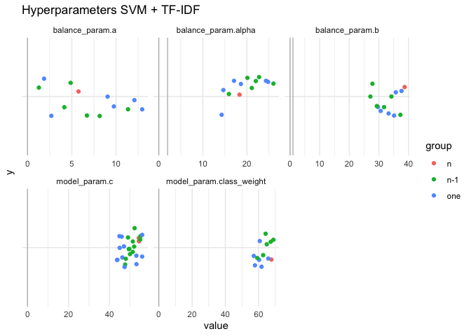
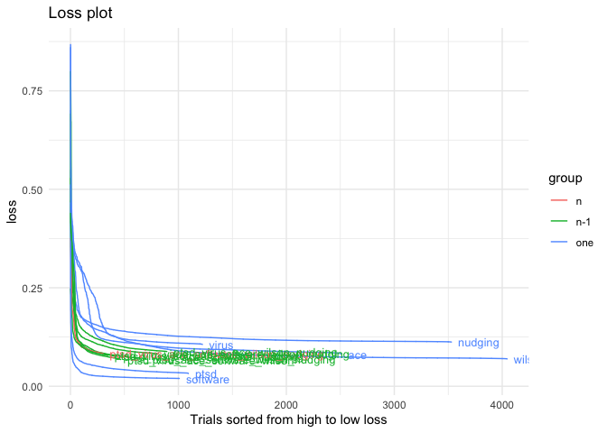
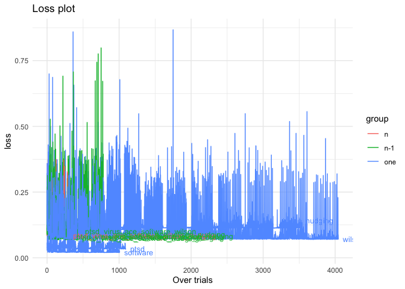
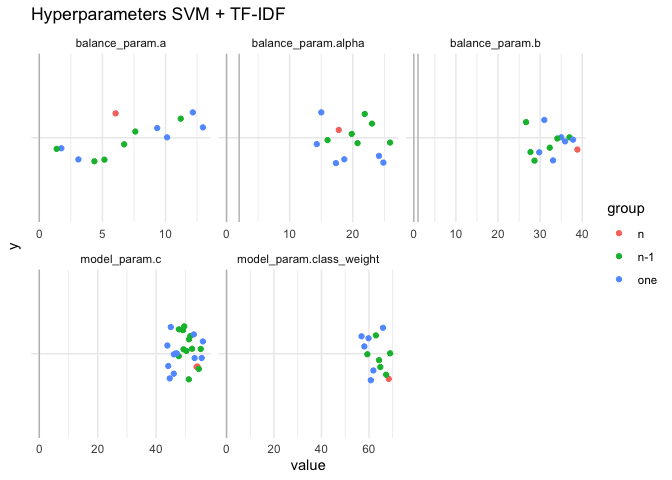
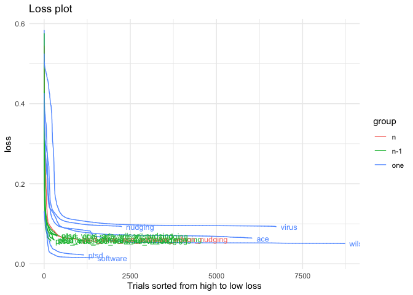
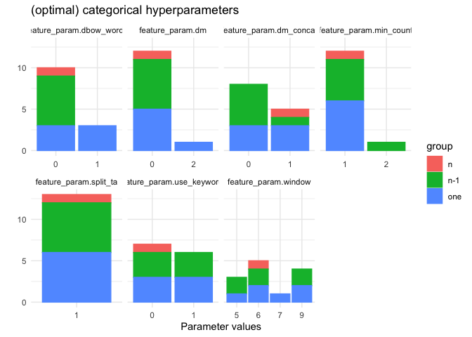
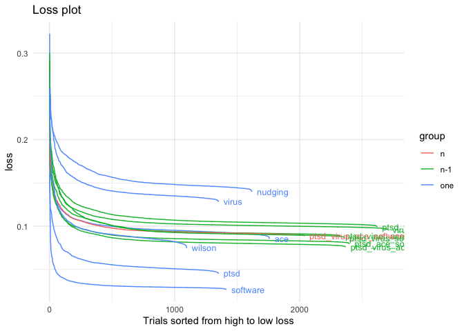
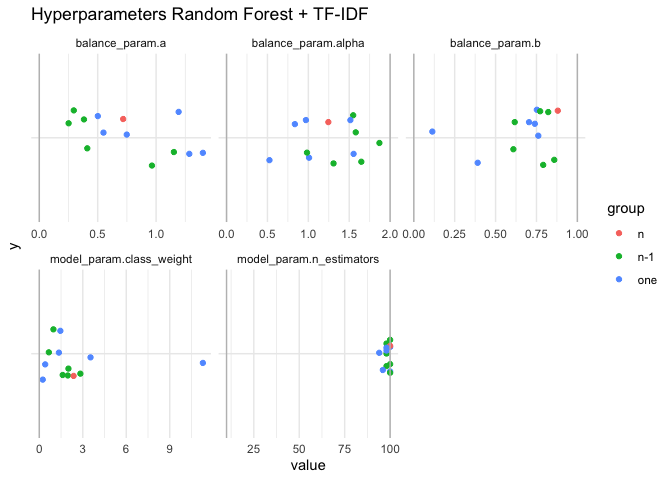
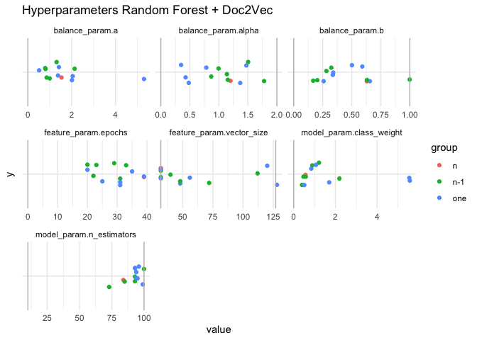
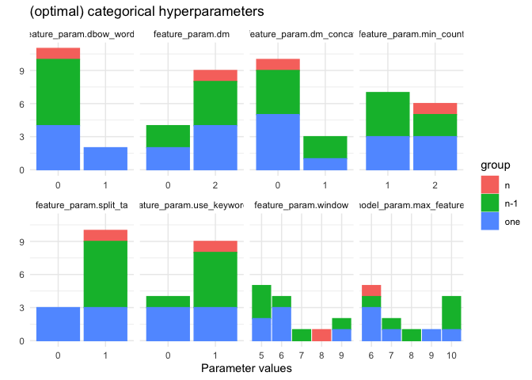

Hyperparameter Optimization
===========================

To every model belongs a unique set of hyperparameters. To maximize
model performance, we need to find optimal values for the
hyperparameters. For every model the optimal hyperparameter values are
determined by optimizing on data *d*. The hyperparameters are optimized
by running several hundreds of optimization trials, in which
hyperparameter values are sampled from their possible parameter space.

Maximum model performance is defined as the average time it takes to
find an inclusion in the data, ATD, or more specific: the loss function
minimizes the average number of papers needed to screen to find an
inclusion (the area above the curve in the inclusion plot).

### Content

The `scripts` folder contains all scripts run on the Cartesius
supercomputer. The `log.Rmd` file tracks when all these scripts were
executed and connects them to a jobID on Cartesius (just for
documentation).

The `trials` folder transforms the raw data into smaller datafiles,
containing the results of the hyperparameter optimization. As mentioned
in the readme of the root directory, the raw files cannot be published
on the OSF yet, however these raw datafiles should yield enough
information for the time being.

The `config` folder contains configuration files containing all sets of
optimal hyperparameters. This file format is necessary for running
simulations later on.

The current readme file analyzes the hyperparameter optimization process
(stored in `trials`), and creates the visual inspection of the
hyperparameters given below.

`README_files` stores the figures displayed in the current readme.

### Running optimization trials

If you have no access to Cartesius, you can still run optimization
trials on your own device. For example, for optimizing the NB + TF-IDF
model on the ace dataset for 12 hours, run the following command in your
bash terminal:

``` bash
asreview hyper-active -t 12:00:00 -m nb -b double -e tfidf -q max -d ../../datasets/test_datasets/ace
```

This will create a file structure
`output/active/nb_max_double_tfidf/ace`. To create a configuration file
from your optimized trials, run:

``` bash
asreview create-config output/active/nb_max_double_tfidf/ace/trials.pkl
```

For more information, check out
<a href="https://github.com/asreview/asreview-hyperopt" class="uri">https://github.com/asreview/asreview-hyperopt</a>.

Optimizing Hyperparameters
==========================

The optimization data d consists of (a subset from) the six systematic
review datasets D mentioned above. Three different approaches in
composing d are explored:

-   **one**, where hyperparameters are optimized on only one of the six
    datasets. Such hyperparameters are expected to lead to maximum
    performance in the same dataset d.
-   **n**, where hyperparameters are optimized on all six data sets.
    This optimization approach intends to serve in producing the most
    optimal hyperparameters overall.
-   **n-1**, where hyperparameters are optimized on all six datasets but
    one. Serving as a sensitivity analysis for the former condition,
    e.g. how sensitive are the hyperparamters to different data sets.

This results in 6+6+1=13 sets of hyperparameters for every model.
Optimization trials were visually inspected to check if an optimum
(minimal loss) has been reached. More trials were run if the loss still
seemed to go down at a quick pace. The hyperparameter sets that were
found to lead to a minimum loss value were visually inspected.

The **one** hyperparameters are used in the simulations of the current
thesis. The remaining sets of hyperparameters will be used in a future
project. The `config` folder contains stores all sets of
hyperparameters.

<!-- ## Results -->
<!-- Loss plots: Two times the same data, first plot is over trials, second sorted from highest to lowest loss. -->
<!-- Hyperparameters on a continuous scale are plotted as dots in a scatterplot.  -->
<!-- Discrete hyperparameters are displayed in a barplot -->
<!-- Conclusions:  -->
<!-- - loss is going down over trials  -->
<!-- - some datasets go down faster -->
<!-- - some datasets go down more  -->

Naive Bayes + TF-IDF
====================

Loss plots
----------


Hyperparameter values
---------------------


Inspect outliers:

| datasets     | group | param              |     value|
|:-------------|:------|:-------------------|---------:|
| ace.ini      | one   | balance\_param.a   |   1249.91|
| software.ini | one   | model\_param.alpha |  98353.37|

SVM + TF-IDF
============


\# SVM + Doc2Vec



Logistic Regression + TF-IDF
============================


Inspect outliers

| datasets     | group | param            |       value|
|:-------------|:------|:-----------------|-----------:|
| ace.ini      | one   | balance\_param.a |  1138.85322|
| software.ini | one   | model\_param.c   |    45.39681|
| software.ini | one   | model\_param.c   |    45.39681|

| datasets                                   | group | param                      |      value|
|:-------------------------------------------|:------|:---------------------------|----------:|
| ptsd\_virus\_ace\_wilson\_nudging.ini      | n-1   | model\_param.class\_weight |   7434.110|
| ptsd\_virus\_software\_wilson\_nudging.ini | n-1   | model\_param.class\_weight |   5505.882|
| software.ini                               | one   | model\_param.class\_weight |  50289.387|

Logistic Regression + Doc2Vec
=============================



Random Forest + TF-IDF
======================



Random Forest + Doc2Vec
=======================

Loss plot
---------


Hyperparameter Values
---------------------


