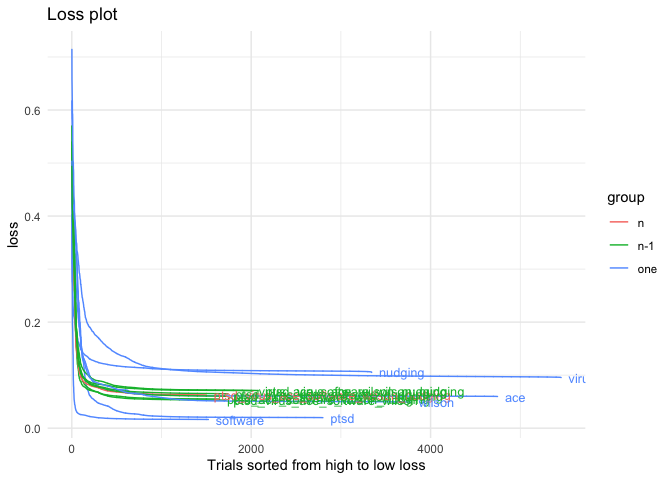
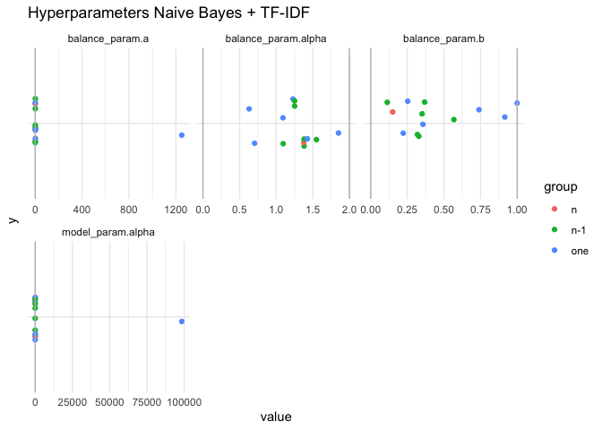
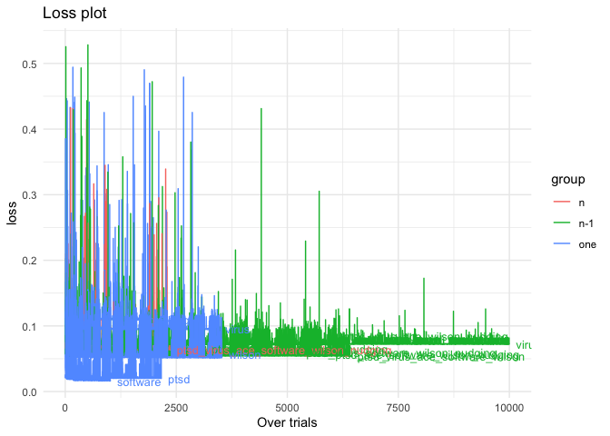

Optimizing Hyperparameters
==========================

To every model belongs a unique set of hyperparameters. To maximize
model performance, we need to find optimal values for the
hyperparameters. For every model the optimal hyperparameter values are
determined by optimizing on data *d*. The hyperparameters are optimized
by running several hundreds of optimization trials, in which
hyperparameter values are sampled from their possible parameter space.

Maximum model performance is defined as the average time it takes to
find an inclusion in the data, or more specific: the loss function
minimizes the average number of papers needed to screen to find an
inclusion (eg the area above the curve in the inclusion plot).

The optimization data d consists of (a subset from) the six systematic
review datasets D mentioned above. Three different approaches in
composing d are explored:

-   **one**, where hyperparameters are optimized on only one of the six
    datasets. Such hyperparameters are expected to lead to maximum
    performance in the same dataset d.
-   **n**, where hyperparameters are optimized on all six data sets.
    This optimization approach intends to serve in producing the most
    optimal hyperparameters overall.
-   **n-1**, where hyperparameters are optimized on all six datasets but
    one. Serving as a sensitivity analysis for the former condition, eg
    how sensitive are the hyperparamters to different data sets.

This results in 6+6+1=13 sets of hyperparameters for every model.
Optimization trials were visually inspected to check if an optimum
(minimal loss) has been reached. More trials were run if the loss still
seemed to go down at a quick pace. The hyperparameter sets that were
found to lead to a minimum loss value were visually inspected.

Naive Bayes + TF-IDF
====================

Loss plots
----------

Two times the same data, first plot is over trials, second sorted from
highest to lowest loss.

Hyperparameter values
---------------------

SVM + TF-IDF
============

Logistic Regression + TF-IDF
============================

Logistic Regression + Doc2Vec
=============================

Random Forest + TF-IDF
======================

Random Forest + Doc2Vec
=======================

Loss plot
---------

Hyperparameter Values
---------------------

