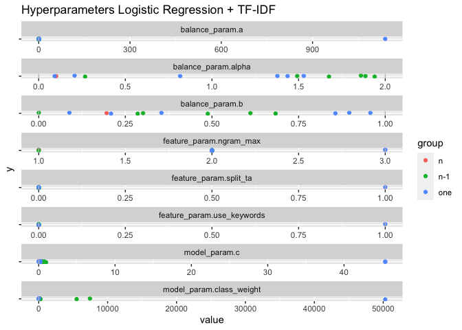
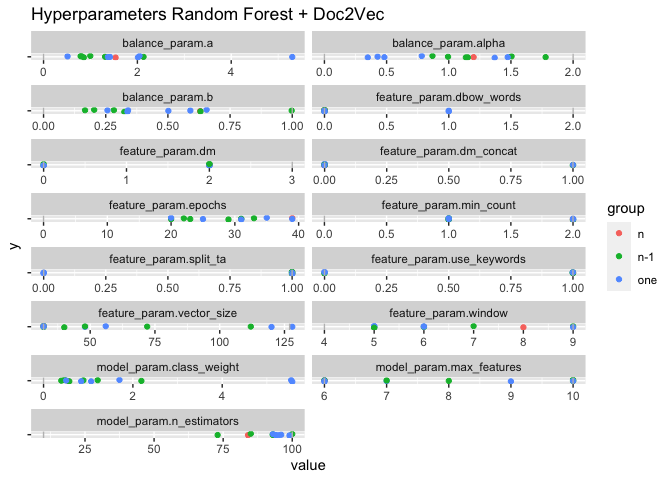
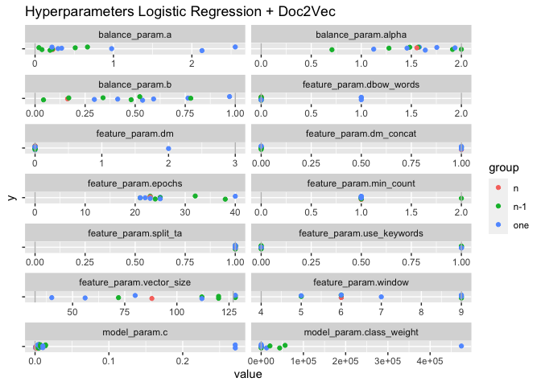
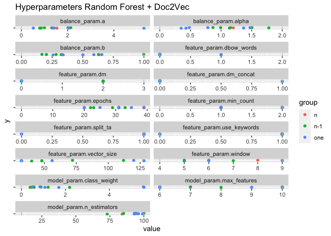
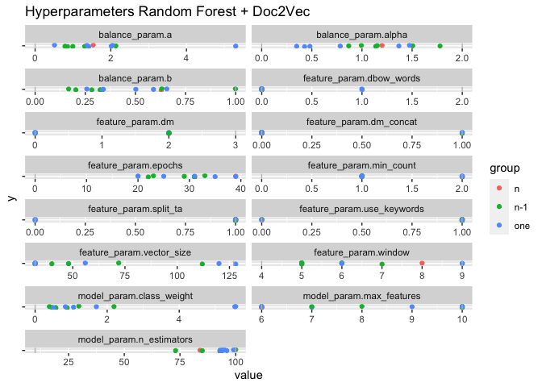

Results hyperparameter optimization
================

<!-- -->

<!-- -->

<!-- -->

<!-- -->

<!-- -->

statistics for random forest + tf-idf

| param                        | group |   variance |        sd |         min |        mean |      median |         max |
| :--------------------------- | :---- | ---------: | --------: | ----------: | ----------: | ----------: | ----------: |
| balance\_param.a             | n     |         NA |        NA |   0.7192764 |   0.7192764 |   0.7192764 |   0.7192764 |
| balance\_param.a             | n-1   |  0.1468576 | 0.3832200 |   0.2517644 |   0.5759883 |   0.3958779 |   1.1526690 |
| balance\_param.a             | one   |  0.1550743 | 0.3937948 |   0.5025175 |   0.9462516 |   0.9707551 |   1.3997309 |
| balance\_param.alpha         | n     |         NA |        NA |   1.2436355 |   1.2436355 |   1.2436355 |   1.2436355 |
| balance\_param.alpha         | n-1   |  0.0935370 | 0.3058381 |   0.9844457 |   1.4893711 |   1.5636714 |   1.8677820 |
| balance\_param.alpha         | one   |  0.1589328 | 0.3986638 |   0.5257832 |   1.0682214 |   0.9901227 |   1.5540455 |
| balance\_param.b             | n     |         NA |        NA |   0.8816155 |   0.8816155 |   0.8816155 |   0.8816155 |
| balance\_param.b             | n-1   |  0.0114292 | 0.1069075 |   0.6083973 |   0.7447667 |   0.7807418 |   0.8599103 |
| balance\_param.b             | one   |  0.0714012 | 0.2672100 |   0.1140660 |   0.5769489 |   0.7222529 |   0.7618167 |
| feature\_param.ngram\_max    | n     |         NA |        NA |   1.0000000 |   1.0000000 |   1.0000000 |   1.0000000 |
| feature\_param.ngram\_max    | n-1   |  0.0000000 | 0.0000000 |   1.0000000 |   1.0000000 |   1.0000000 |   1.0000000 |
| feature\_param.ngram\_max    | one   |  0.1666667 | 0.4082483 |   1.0000000 |   1.1666667 |   1.0000000 |   2.0000000 |
| feature\_param.split\_ta     | n     |         NA |        NA |   1.0000000 |   1.0000000 |   1.0000000 |   1.0000000 |
| feature\_param.split\_ta     | n-1   |  0.1666667 | 0.4082483 |   0.0000000 |   0.8333333 |   1.0000000 |   1.0000000 |
| feature\_param.split\_ta     | one   |  0.2666667 | 0.5163978 |   0.0000000 |   0.6666667 |   1.0000000 |   1.0000000 |
| feature\_param.use\_keywords | n     |         NA |        NA |   1.0000000 |   1.0000000 |   1.0000000 |   1.0000000 |
| feature\_param.use\_keywords | n-1   |  0.0000000 | 0.0000000 |   1.0000000 |   1.0000000 |   1.0000000 |   1.0000000 |
| feature\_param.use\_keywords | one   |  0.1666667 | 0.4082483 |   0.0000000 |   0.8333333 |   1.0000000 |   1.0000000 |
| model\_param.class\_weight   | n     |         NA |        NA |   2.3660456 |   2.3660456 |   2.3660456 |   2.3660456 |
| model\_param.class\_weight   | n-1   |  0.6139151 | 0.7835274 |   0.6578300 |   1.6759356 |   1.7899422 |   2.8340870 |
| model\_param.class\_weight   | one   | 17.6801643 | 4.2047787 |   0.2381063 |   3.0447539 |   1.4022172 |  11.2858816 |
| model\_param.max\_features   | n     |         NA |        NA |   8.0000000 |   8.0000000 |   8.0000000 |   8.0000000 |
| model\_param.max\_features   | n-1   |  3.3666667 | 1.8348479 |   6.0000000 |   8.8333333 |  10.0000000 |  10.0000000 |
| model\_param.max\_features   | one   |  1.6000000 | 1.2649111 |   7.0000000 |   9.0000000 |   9.5000000 |  10.0000000 |
| model\_param.n\_estimators   | n     |         NA |        NA | 100.0000000 | 100.0000000 | 100.0000000 | 100.0000000 |
| model\_param.n\_estimators   | n-1   |  1.2000000 | 1.0954451 |  98.0000000 |  99.0000000 |  99.0000000 | 100.0000000 |
| model\_param.n\_estimators   | one   |  5.4666667 | 2.3380904 |  94.0000000 |  97.6666667 |  98.0000000 | 100.0000000 |
